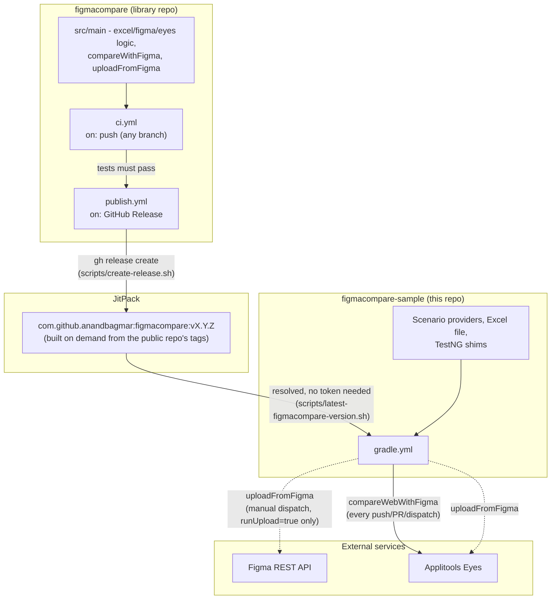

# figmacompare-sample: Figma-to-Production Visual Validation

This project validates that a set of sample web and mobile apps (plus the real Bajaj
Finserv app) match their approved Figma designs, using
[Applitools Eyes](https://applitools.com/platform/eyes/) as the visual comparison
engine. The reusable framework — Excel/Figma/Eyes/Appium plumbing, the plain-Java
`compareWithFigma` runners — lives in a separate, public repo,
[figmacompare](https://github.com/anandbagmar/figmacompare), resolved here via
[JitPack](https://jitpack.io) as `com.github.anandbagmar:figmacompare` (see the
Architecture section below); this repo is a client of it, holding the scenario
providers, Excel file, and thin TestNG shims for
several sample apps (Bajaj Finserv, Calculator, App Automation Playground, Applitools'
own Hello World demo). The workflow:

1. **Upload Figma designs as baselines** — the [uploadFromFigma](docs/README_uploadFromFigma.md)
   utility reads a list of Figma share links from an Excel file, downloads each design,
   and uploads it to Applitools Eyes as the approved visual baseline. Pure Java, no
   browser/device needed.
2. **Capture the real implementation** — [Selenium](docs/README_Web_Selenium.md) drives
   the web (UAT/production) pages, and [Appium](docs/README_Appium_Java.md) drives the
   native Android/iOS apps, to capture the corresponding screens.
3. **Compare** — the [Eyes Selenium Java SDK](https://applitools.com/docs/api-ref/category/selenium-java)
   and [Eyes Appium Java SDK](https://applitools.com/docs/api-ref/category/appium-java)
   run the visual comparison against the Figma baseline and report differences in the
   Applitools dashboard.

This lets the UI/UX team (who own the Figma designs) and the QA team (who own the
Selenium/Appium automation) collaborate on catching design-vs-implementation drift,
without either side needing to touch the other's tooling.

**This repo's docs cover setup and this repo's own example apps/CI.** For how the
underlying pipeline actually behaves — the Excel column schema, `uploadFromFigma`/
`compareWithFigma` semantics, the `ScenarioFlow`/registry pattern, every config
setting — see [figmacompare's own docs](https://github.com/anandbagmar/figmacompare#docs),
linked throughout the pages below.

## Table of contents

- [Full step-by-step workflow: Figma → baseline → compare → review](#full-step-by-step-workflow-figma--baseline--compare--review)
- [Setup instructions](#setup-instructions)
- [Running the Appium (Android/iOS) tests](#running-the-appium-androidios-tests)
- [Running the web tests with Selenium](#running-the-web-tests-with-selenium)
- [Uploading Figma designs as Applitools baselines](#uploading-figma-designs-as-applitools-baselines)
- [Architecture](#architecture)
- [Continuous Integration](#continuous-integration)

# [Full step-by-step workflow: Figma → baseline → compare → review](docs/README_FigmaVisualValidation.md)

# [Setup instructions](docs/README_MachineSetupInstructions.md)

# Running the [Appium (Android/iOS) tests](docs/README_Appium_Java.md)

# Running the [web tests with Selenium](docs/README_Web_Selenium.md)

# Uploading [Figma designs as Applitools baselines](docs/README_uploadFromFigma.md)

## Architecture

Two repos, kept deliberately decoupled: **[figmacompare](https://github.com/anandbagmar/figmacompare)**
is the reusable library (Excel/Figma/Eyes plumbing, the `compareWithFigma` and
`uploadFromFigma` pipelines) with its own tests, versioning, and release process. This
repo (`figmacompare-sample`) is a client of it - scenario providers, the Excel file,
thin TestNG shims - that depends on it as a real published artifact, never by building
it from source.



Solid arrows always happen; dashed arrows are the opt-in manual path. See
[figmacompare's README](https://github.com/anandbagmar/figmacompare#readme) for the
library's own release process, and the Continuous Integration section below for how
this repo's CI is wired.

## Continuous Integration

`.github/workflows/gradle.yml` has three triggers - push to `main`, PR to `main`, and
a manual `workflow_dispatch` - sharing one job whose steps are conditionally gated so
the right subset runs for each:

1. **Build with Gradle** *(every trigger)* — compiles and resolves
   `com.github.anandbagmar:figmacompare` from JitPack (public, no token needed), pinned
   to whatever `scripts/latest-figmacompare-version.sh` resolves as the newest release.
   Doesn't run any tests itself (`-x test`).
2. **Restore CI Figma Excel file from secret** *(every trigger)* — decodes the
   `FIGMA_CI_EXCEL_B64` secret into `figma-visual-testing/figma_mockede2e_web_ci.xlsx`.
3. **Cache Figma downloaded images** *(manual dispatch with `runUpload` checked, only)*
   — restores `downloaded_images/figma-cache/` from the GitHub Actions cache, keyed on
   the Excel file's content hash (falls back to the most recent cache on a miss). See
   [Figma image caching](#figma-image-caching) below for why this exists.
4. **Upload Figma designs as Applitools baselines** *(manual dispatch with `runUpload`
   checked, only)* — runs `uploadFromFigma`, updating the Excel file in place with new
   `Baseline Env Name`/`Batch URL`/`Status` per row. Runs **before** step 5 so compare
   uses these fresh baselines instead of stale ones. Pure Java, no browser needed.
5. **Run web Figma visual tests** *(every trigger)* — runs `compareWebWithFigma` in
   headless Chrome (`HEADLESS=true`) against whatever is currently on disk - the
   just-uploaded baselines on a `runUpload` dispatch, or the untouched restored file
   otherwise - using `APPLITOOLS_API_KEY` to authenticate with Eyes. Also writes its
   own results (`Comparison Batch URL`/`Validation Status`) back into the same file.
6. **Upload updated Excel file with results** *(manual dispatch, only)* — by this point
   the file carries both steps' results, uploaded as a workflow artifact (7-day
   retention) so you can see what happened without digging through logs.
7. **Trim old workflow runs** *(always)* — keeps only the 5 most recent runs, to stay
   within a free account's Actions quota.

`uploadFromFigma` never runs on push/PR — creating new Applitools baselines isn't
something that should happen silently on every commit. To run it: **Actions** tab →
"Java CI with Gradle" → **Run workflow**, check **`runUpload`** (defaults to
unchecked, so a plain dispatch just re-runs compare against existing baselines),
optionally also check **`forceRefresh`** to bypass the image cache. Android/iOS
`compare*WithFigma` aren't wired into CI (would need an emulator/device farm in the
runner) - by design, not an oversight.

### Figma image caching

The first `uploadFromFigma` run (before caching existed) drove the account's Figma
personal access token into repeated `HTTP 429` (rate limited) responses - every CI run
re-downloaded every image from scratch, and several manual test runs in a short window
compounded that. Two independent mitigations now exist:

- **Cross-run caching** (step 3 above) — `downloaded_images/figma-cache/` persists
  between CI runs via `actions/cache`, so a run only downloads images that are new or
  actually changed instead of all of them every time.
- **Client-side request pacing** (`FigmaClient` in `figmacompare`) — every outgoing
  Figma API request is spaced at least 1 second apart, reducing the chance of bursting
  past the rate limit in the first place, independent of the retry-with-backoff logic
  that already existed for when a 429 does happen.

If you still see 429s after both of these, it's most likely that the token itself is
already deep into an extended rate-limit window from recent heavy use (e.g. several
manual dispatches in quick succession while testing) - waiting before retrying is the
only real fix at that point, not a config change.

### Required repo secrets (Settings → Secrets and variables → Actions)

| Secret | Used for |
|---|---|
| `APPLITOOLS_API_KEY` | Authenticating with Applitools Eyes |
| `FIGMA_CI_EXCEL_B64` | Base64 of the CI-scoped Figma Excel file (see below) |
| `FIGMA_TOKEN` | Only used by the manual `uploadFromFigma` run, to call the Figma API |

### Generating `FIGMA_CI_EXCEL_B64`

`figma-visual-testing/*.xlsx` is gitignored — it holds your own working data,
including run results. CI instead uses a **separate, CI-scoped** file containing only
the `Web`-platform rows with the result columns (`Status`, `Baseline Batch URL`, etc.)
left blank, so nothing stale gets committed or reused across runs. This file is not
committed either — it's stored as a base64-encoded secret and reconstructed at the
start of each CI run:

**macOS:**
```bash
base64 -i figma-visual-testing/figma_mockede2e_web_ci.xlsx | pbcopy
```

**Linux** (copies to the X11 clipboard via `xclip`; install it first if needed, e.g.
`sudo apt install xclip`):
```bash
base64 -w0 figma-visual-testing/figma_mockede2e_web_ci.xlsx | xclip -selection clipboard
```

**Windows (PowerShell):**
```powershell
[Convert]::ToBase64String([IO.File]::ReadAllBytes("figma-visual-testing\figma_mockede2e_web_ci.xlsx")) | Set-Clipboard
```

**Windows (Command Prompt)** — no built-in clipboard-friendly one-liner; use
`certutil` to write the encoded value to a file, then open and copy it manually:
```
certutil -encode figma-visual-testing\figma_mockede2e_web_ci.xlsx encoded.b64.txt
```
(Open `encoded.b64.txt`, strip the `-----BEGIN CERTIFICATE-----`/`-----END
CERTIFICATE-----` header/footer lines, and copy the remaining base64 body.)

Paste the clipboard contents as the `FIGMA_CI_EXCEL_B64` secret's value. Regenerate
and re-set the secret whenever the `Web` rows change (new scenario step, new
component locator, etc.).

