Back to main [README](../README.md)

# Figma Visual Validation — full workflow

This is the end-to-end runbook for validating Bajaj Finserv's web/mobile
implementation against approved Figma designs. It ties together two programs
(`uploadFromFigma`, `compareWithFigma`) and the manual steps around them, all driven
by **one shared Excel file** that accumulates columns as it moves through the
pipeline — the same file is read from and written back to (in place) at every
stage, so there's no copying between stage-specific files.

| Status | Program |
|---|---|
| ✅ Implemented | [uploadFromFigma](README_uploadFromFigma.md) |
| ✅ Implemented | `compareWithFigma` web path — `WebCompareRunner.java` (in figmacompare) / [CompareWebWithFigmaTest.java](../src/test/java/io/eot/pipeline/web/selenium/CompareWebWithFigmaTest.java), see [README_Web_Selenium.md](README_Web_Selenium.md) |
| ✅ Implemented (Android + iOS) | `compareWithFigma` mobile path — `AndroidCompareRunner.java` (in figmacompare) / `IosCompareRunner.java` (in figmacompare) runners + scenario provider classes (e.g. [BajajFinservAndroidTest.java](../src/test/java/io/eot/bajajfinserv/appium/android/BajajFinservAndroidTest.java)), see [README_Appium_Java.md](README_Appium_Java.md) |

## Table of contents

- [Overview](#overview)
- [Roles](#roles)
- [Single vs. multi-step tests ("scenarios")](#single-vs-multi-step-tests-scenarios)
- [Pre-flight validation ("dry run")](#pre-flight-validation-dry-run)
- [The Excel file, end to end](#the-excel-file-end-to-end)
- [Step 1 — Prepare the Excel file](#step-1-prepare-the-excel-file-manually-prepared-by-the-uiux-team)
- [Step 2 — Upload Figma designs as baselines](#step-2-upload-figma-designs-as-baselines-automated-qa)
- [Step 3 — Identify validation scope](#step-3-identify-validation-scope-manual-qa)
- [Step 4 — Compare implementation against Figma baseline](#step-4-compare-implementation-against-figma-baseline)
- [Step 5 — Review and report](#step-5-review-and-report-uiux-team-will-manually-review-the-results)
- [How to add a new test / scenario](#how-to-add-a-new-test-scenario)

Related docs: [README_Scenarios.md](README_Scenarios.md) ·
[README_AddingTests.md](README_AddingTests.md) ·
[README_uploadFromFigma.md](README_uploadFromFigma.md) ·
[README_Web_Selenium.md](README_Web_Selenium.md) ·
[README_Appium_Java.md](README_Appium_Java.md)

## Overview

Each box below shows, top to bottom: what goes **in**, what runs, and what comes **out** —
color shows which role is responsible for that stage.

```mermaid
flowchart TD
    classDef uiux fill:#dbe9ff,stroke:#3366cc,color:#000,text-align:left
    classDef qa fill:#ffe9cf,stroke:#cc8800,color:#000,text-align:left
    classDef gate fill:#f5f5f5,stroke:#999999,color:#000,text-align:left

    S1["<b>Step 1 · UI/UX Team</b><br/>─────────<br/>IN: Figma designs; list of pages/<br/>screens/scenarios to validate<br/>─────────<br/>DO: fill in one Excel row per<br/>design (group scenario steps by<br/>a shared Scenario Name)<br/>─────────<br/>OUT: Figma URL, Platform, App URL/<br/>Screen Name, Scenario Name"]

    V1{"<b>Step 2 · QA</b> runs<br/>./gradlew uploadFromFigma<br/>─────────<br/>Pre-flight validation OK?"}
    V1fail["OUT: full list of problems<br/>printed, nothing runs"]
    Upload["<b>Step 2 · QA</b> (automated)<br/>─────────<br/>IN: Excel from Step 1 +<br/>config.properties (FIGMA_TOKEN,<br/>Applitools creds)<br/>─────────<br/>DO: group rows by Scenario Name;<br/>download Figma image(s); upload<br/>as one Applitools test per group<br/>─────────<br/>OUT: App Name, Baseline Env Name,<br/>Baseline Batch URL, Status"]

    S3["<b>Step 3 · QA</b> (manual)<br/>─────────<br/>IN: Excel from Step 2<br/>(Baseline Batch URL) +<br/>Applitools dashboard<br/>─────────<br/>DO: review each baseline, decide<br/>full page vs. component<br/>─────────<br/>OUT: Locator (web rows only)"]

    V2{"<b>Step 4 · QA</b> runs<br/>./gradlew compareWebWithFigma /<br/>compareAndroidWithFigma<br/>─────────<br/>Pre-flight validation OK?"}
    V2fail["OUT: full list of problems<br/>printed, nothing runs"]
    Compare["<b>Step 4 · QA</b> (automated)<br/>─────────<br/>IN: Excel from Step 3 + the live<br/>UAT/Prod app (web URLs, or a<br/>registered mobile ScenarioFlow)<br/>─────────<br/>DO: group rows by Scenario Name;<br/>Selenium (web) or Appium (mobile)<br/>runs each group as one test<br/>─────────<br/>OUT: Comparison Batch URL,<br/>Validation Status"]

    S5["<b>Step 5 · UI/UX Team</b> (manual)<br/>─────────<br/>IN: Excel from Step 4 +<br/>Applitools dashboard<br/>─────────<br/>DO: review flagged differences<br/>with Visual AI<br/>─────────<br/>OUT: Jira issues for real<br/>discrepancies"]

    S1 --> V1
    V1 -- no --> V1fail
    V1 -- yes --> Upload --> S3
    S3 --> V2
    V2 -- no --> V2fail
    V2 -- yes --> Compare --> S5

    class S1,S5 uiux
    class Upload,S3,Compare qa
    class V1,V1fail,V2,V2fail gate
```



## Roles

- **UI/UX Team** — owns the Figma designs, prepares the initial Excel rows,
  reviews final visual differences, files Jira issues.
- **QA** — runs both programs, fills in the `Locator` column for web components,
  writes the bespoke mobile scenario tests (see below), and helps triage failures.

## Single vs. multi-step tests ("scenarios")

Most rows are standalone: one Figma export = one full page or component = one
Applitools test. The Applitools Figma plugin also supports exporting several
Figma frames together as the steps of **one** multi-step test, via the
`Scenario Name` column — required for every Android/iOS row, optional for Web.
See [README_Scenarios.md](README_Scenarios.md) for the full explanation
of how `Scenario Name`, the scenario registries, and `ScenarioFlow` work.

## Pre-flight validation ("dry run")

Before `uploadFromFigma` or `compareWithFigma` do any real work (Figma/Applitools
API calls, browser/app launches), they validate the *entire* file and report every
problem found at once — nothing runs partially. Checks include:

- `Figma URL` (with a `node-id`), `Platform` (`Web`/`Android`/`iOS`), and
  `App URL / Screen Name` present on every non-`Skip` row; `Viewport` (if set)
  matches `WIDTHxHEIGHT`.
- **`Scenario Name` is required for every Android/iOS row** (see above) — a hard
  error if it's blank.
- **Scenario rows are contiguous** — a `Scenario Name` reused by non-adjacent rows
  is a hard error naming the offending row numbers.
- **Scenario metadata is consistent** — `Baseline Env Name`/`App Name`/`Viewport`
  must agree across every row in a scenario; a hard error names the conflicting
  values and rows.
- **Step names are unique within a scenario.**
- For `compareAndroidWithFigma` specifically: every distinct `Scenario Name` used
  by an Android row has a matching entry in `AndroidScenarioRegistry` (from
  *any* provider class).

This isn't a separate command — it's the first thing each of `uploadFromFigma`,
`compareWebWithFigma`, and `compareAndroidWithFigma` does.

## The Excel file, end to end

One row = one Figma design (a full page or a single component) paired 1-to-1 with
the corresponding place to find it in the real app — a **URL** for web, or a
**screen name** for mobile (since a mobile app has no URL to navigate to
directly). The file can have any number of rows; both programs iterate every row,
skipping any row marked `Skip`.

It's **one file for the whole pipeline**, by default `figma-visual-testing/figma_visual_tests.xlsx`
(configurable — see [Choosing the Excel file path](README_uploadFromFigma.md#choosing-the-excel-file-path)).
Some columns only matter to one stage; it's fine to leave those blank until that
stage runs:

| Column | Filled in by |
|---|---|
| `Figma URL`, `Platform`, `App URL / Screen Name` | Step 1 (UI/UX team) |
| `Scenario Name` | Step 1 — **required for Android/iOS**; optional for Web (groups this row with others sharing the same value into one multi-step test) |
| `Test Name`, `Baseline Env Name`, `Viewport`, `Scale`, `Format`, `Skip` | Step 1, optional — auto-derived by Step 2 if left blank |
| `App Name`, `Baseline Batch URL`, `Status`, `Error Message` | Step 2 (`uploadFromFigma`) |
| `Locator` | Step 3 (QA), web rows only |
| `Comparison Batch URL`, `Validation Status` | Step 4 (`compareWithFigma`) |

## Step 1 — Prepare the Excel file *(Manually prepared by the UI/UX team)*

Copy the template and fill in one row per Figma design to validate — see
[README_uploadFromFigma.md § 2](README_uploadFromFigma.md#2-fill-in-the-figma-excel-file)
for the full column reference. The columns worth calling out here:

| Column | Required? | Notes |
|---|---|---|
| `Figma URL` | Yes | Share link to a specific frame/component (must contain `node-id`) |
| `Platform` | Yes | `Web`, `Android`, or `iOS` |
| `App URL / Screen Name` | Yes | For `Web`: the UAT/production URL. For `Android`/`iOS`: a screen name/identifier — not a URL, since reaching a mobile screen usually needs app navigation |
| `Scenario Name` | **Yes for Android/iOS**; optional for Web | Names the Applitools test this row belongs to. For mobile, must match a scenario registered in `AndroidScenarioRegistry` (ask QA to write one if it doesn't exist yet). For web, shared by consecutive rows to group them into one multi-step test; leave blank for a standalone row |
| `Baseline Env Name` | No | Provide your own baseline env name, or leave blank to auto-derive `{testName}-baseline` (standalone) / `{scenarioName}-baseline` (scenario) |
| `Skip` | No | `true`/`t`/`yes`/`y`/`skip` (case-insensitive) excludes this row from a run without removing it — useful for running only a subset |

## Step 2 — Upload Figma designs as baselines *(Automated — QA)* ✅

Run `./gradlew uploadFromFigma`. Details: [README_uploadFromFigma.md](README_uploadFromFigma.md).

For a standalone row, this is one Applitools test with one step. For a scenario,
every row in the group is downloaded and uploaded as the steps of **one**
Applitools test — `App Name`, `Baseline Env Name`, `Baseline Batch URL`, `Status`
are written back onto every row in the group (they describe the one shared test,
not the individual step). This step doesn't need `AndroidScenarioRegistry` at all —
it just uploads whatever Figma images the sheet lists; only Step 4 needs a
matching mobile scenario to actually be registered.

## Step 3 — Identify validation scope *(Manual — QA)*

Open the same file (`figma_visual_tests.xlsx`) — no copying needed. For each row,
open `Baseline Batch URL` and decide what should be validated:

- **Web rows**: leave `Locator` blank for full-page validation, or fill it in with a
  CSS/XPath selector to validate just that component against the Figma baseline.
  This applies per step in a scenario too — each step can independently be
  full-page or a specific component.
- **Mobile rows**: always full-page — `Locator` is not used for Android/iOS. This
  is also when QA should confirm (or write) the `ScenarioFlow` that `Scenario Name`
  needs, if it doesn't already exist.

## Step 4 — Compare implementation against Figma baseline

`compareWithFigma` iterates every non-`Skip` row/scenario and runs the Applitools
Eyes comparison against `Baseline Env Name` from Step 2, writing back
`Comparison Batch URL` + `Validation Status` (`Passed`/`Unresolved`/`Failed`) into
the same file, in place — plus a final pass/fail summary. For a scenario, one
result is written onto every row in that group, since it's one Applitools test.

**4a. Web rows — fully generic. ✅ Implemented** as
`WebCompareRunner` (plain-Java orchestration, in figmacompare) driven by
[CompareWebWithFigmaTest.java](../src/test/java/io/eot/pipeline/web/selenium/CompareWebWithFigmaTest.java)
(thin TestNG shim, in this repo): data-driven from the shared Excel file, one
invocation per group of `Platform=Web` rows (a standalone row is a group of one).
Selenium opens `App URL / Screen Name` directly for each row/step in the group, in
the same continuous browser session — no per-row code needed even for a multi-step
scenario. Full page if `Locator` is blank, otherwise just that region. One
`VisualGridRunner`/`BatchInfo` pair is shared for the whole run, so groups just
submit their checks; results are collected once at the end (`afterSuite()`),
matched back to each group's rows by test/scenario name, written to the Excel
file, and the suite fails there if anything mismatched. Run it with:
```bash
./gradlew compareWebWithFigma
# or against a specific file:
./gradlew compareWebWithFigma -PfigmaExcel=path/to/file.xlsx
```
See [README_Web_Selenium.md](README_Web_Selenium.md) for details.

**4b. Mobile rows — every test is bespoke, dispatched by Scenario Name. ✅
Implemented for Android and iOS** via two kinds of class working together, per
platform:

- One **runner** (plain-Java orchestration in figmacompare + a thin TestNG shim in
  `samples`), used for every app on that platform:
  `AndroidCompareRunner` (in figmacompare) /
  `IosCompareRunner` (in figmacompare).
  One invocation per group of `Platform=Android`/`iOS` rows sharing a
  `Scenario Name`. It looks up that name in
  `AndroidScenarioRegistry`/`IosScenarioRegistry`, launches the registered app
  (APK or `.app`), hands the group to the registered `ScenarioFlow`, then does
  the Applitools comparison + Excel write-back, same as the web path.
- App-specific **scenario providers** — not TestNG tests, just a static block
  registering that app's scenarios, e.g.
  [`BajajFinservAndroidTest`](../src/test/java/io/eot/bajajfinserv/appium/android/BajajFinservAndroidTest.java)
  or
  [`AppAutomationPlaygroundAndroidPlannerScenarioTest`](../src/test/java/io/eot/mockede2e/appium/android/AppAutomationPlaygroundAndroidPlannerScenarioTest.java)
  (with an iOS counterpart,
  [`AppAutomationPlaygroundIosPlannerScenarioTest`](../src/test/java/io/eot/mockede2e/appium/ios/AppAutomationPlaygroundIosPlannerScenarioTest.java)):
  ```java
  AndroidScenarioRegistry.register("android-home-screen", APK_NAME, APP_NAME, (driver, eyes, rows) -> {
      // whatever this app's real login/navigation needs, then:
      eyes.checkWindow(resolveStepName(rows.get(0)));
  });
  ```
  A scenario is looked up purely by name — the runner doesn't know or care which
  provider class registered it, so a scenario referenced in the Excel can be
  implemented in *any* class file.

```bash
./gradlew compareAndroidWithFigma
./gradlew compareIosWithFigma
```

A new app means: a new provider class following the existing pattern for that
platform, plus **one line** added to the `PROVIDER_CLASSES` list in
`CompareAndroidWithFigmaTest` / `CompareIosWithFigmaTest` so its registrations
actually run (Java only executes a class's static initializer once that class is
loaded/referenced — an unreferenced provider class would silently register
nothing). The runner itself never needs to change. All of these reuse the shared
`AppiumServerSupport` (in figmacompare),
`AndroidDriverFactory` (in figmacompare) /
`IosDriverFactory` (in figmacompare),
`BatchSupport` (in figmacompare),
`ComparisonResultRecorder` (in figmacompare),
`FigmaExcelFile` (in figmacompare), and
`FigmaValidation` (in figmacompare) utilities.

## Step 5 — Review and report *(UI/UX team will manually review the results)*

Open the same Excel file, filter rows where `Validation Status` is `Unresolved` or
`Failed`, open each `Comparison Batch URL` in the Applitools dashboard, and use the
Visual AI match algorithms to judge whether a flagged difference is a real
implementation bug. File a Jira issue directly from Applitools for valid discrepancies.


## How to add a new test / scenario

Six worked recipes, from "no code" (a new web row) to "plugging in your own
existing Appium tests" — see [README_AddingTests.md](README_AddingTests.md).
