Back to main [README](../README.md)

# Figma Visual Validation — full workflow

This is the end-to-end runbook for validating Bajaj Finserv's web/mobile
implementation against approved Figma designs, using this repo's own roles/process.
For what each program actually does under the hood - the Excel schema, pre-flight
validation rules, `uploadFromFigma`/`compareWithFigma` behavior - see figmacompare's
own docs, linked throughout below.

| Status | Program |
|---|---|
| ✅ Implemented | [uploadFromFigma](README_uploadFromFigma.md) |
| ✅ Implemented | `compareWithFigma` web path — see [README_Web_Selenium.md](README_Web_Selenium.md) |
| ✅ Implemented (Android + iOS) | `compareWithFigma` mobile path — see [README_Appium_Java.md](README_Appium_Java.md) |

## Table of contents

- [Overview](#overview)
- [Roles](#roles)
- [Step 1 — Prepare the Excel file](#step-1-prepare-the-excel-file-manually-prepared-by-the-uiux-team)
- [Step 2 — Upload Figma designs as baselines](#step-2-upload-figma-designs-as-baselines-automated-qa)
- [Step 3 — Identify validation scope](#step-3-identify-validation-scope-manual-qa)
- [Step 4 — Compare implementation against Figma baseline](#step-4-compare-implementation-against-figma-baseline)
- [Step 5 — Review and report](#step-5-review-and-report-uiux-team-will-manually-review-the-results)
- [How to add a new test / scenario](#how-to-add-a-new-test-scenario)

> **Windows note:** every `./gradlew ...` command shown below (macOS/Linux syntax)
> works the same way on Windows — just run `gradlew.bat ...` instead, from Command
> Prompt or PowerShell.

Related docs: [README_AddingTests.md](README_AddingTests.md) ·
[README_uploadFromFigma.md](README_uploadFromFigma.md) ·
[README_Web_Selenium.md](README_Web_Selenium.md) ·
[README_Appium_Java.md](README_Appium_Java.md) · figmacompare's
[ExcelSchema.md](https://github.com/anandbagmar/figmacompare/blob/main/docs/ExcelSchema.md) ·
[CompareWithFigma.md](https://github.com/anandbagmar/figmacompare/blob/main/docs/CompareWithFigma.md)

## Overview

Each box below shows, top to bottom: what goes **in**, what runs, and what comes **out** —
color shows which role is responsible for that stage. One shared Excel file drives
the whole pipeline - see figmacompare's
[ExcelSchema.md](https://github.com/anandbagmar/figmacompare/blob/main/docs/ExcelSchema.md)
for the full column reference.



```mermaid
flowchart TD
    classDef uiux fill:#dbe9ff,stroke:#3366cc,color:#000,text-align:left
    classDef qa fill:#ffe9cf,stroke:#cc8800,color:#000,text-align:left
    classDef gate fill:#f5f5f5,stroke:#999999,color:#000,text-align:left

    S1["<b>Step 1 · UI/UX Team</b><br/>─────────<br/>IN: Figma designs; list of pages/<br/>screens/scenarios to validate<br/>─────────<br/>DO: fill in one Excel row per<br/>design (group scenario steps by<br/>a shared Scenario Name)<br/>─────────<br/>OUT: Figma URL, Platform, App URL/<br/>Screen Name, Scenario Name"]

    V1{"<b>Step 2 · QA</b> runs<br/>./gradlew uploadFromFigma<br/>─────────<br/>Pre-flight validation OK?"}
    V1fail["OUT: full list of problems<br/>printed, nothing runs"]
    Upload["<b>Step 2 · QA</b> (automated)<br/>─────────<br/>IN: Excel from Step 1 +<br/>config.properties (FIGMA_TOKEN,<br/>Applitools creds)<br/>─────────<br/>DO: group rows by Scenario Name;<br/>download Figma image(s); upload<br/>as one Applitools test per group<br/>─────────<br/>OUT: App Name, Baseline Env Name,<br/>Baseline Batch URL, Status"]

    S3["<b>Step 3 · QA</b> (manual)<br/>─────────<br/>IN: Excel from Step 2<br/>(Baseline Batch URL) +<br/>Applitools dashboard<br/>─────────<br/>DO: review each baseline, decide<br/>full page vs. component<br/>─────────<br/>OUT: Locator (web rows only)"]

    V2{"<b>Step 4 · QA</b> runs<br/>./gradlew compareWebWithFigma /<br/>compareAndroidWithFigma<br/>─────────<br/>Pre-flight validation OK?"}
    V2fail["OUT: full list of problems<br/>printed, nothing runs"]
    Compare["<b>Step 4 · QA</b> (automated)<br/>─────────<br/>IN: Excel from Step 3 + the live<br/>UAT/Prod app (web URLs, or a<br/>registered mobile ScenarioFlow)<br/>─────────<br/>DO: group rows by Scenario Name;<br/>Selenium (web) or Appium (mobile)<br/>runs each group as one test<br/>─────────<br/>OUT: Comparison Batch URL,<br/>Validation Status"]

    S5["<b>Step 5 · UI/UX Team</b> (manual)<br/>─────────<br/>IN: Excel from Step 4 +<br/>Applitools dashboard<br/>─────────<br/>DO: review flagged differences<br/>with Visual AI<br/>─────────<br/>OUT: Jira issues for real<br/>discrepancies"]

    S1 --> V1
    V1 -- no --> V1fail
    V1 -- yes --> Upload --> S3
    S3 --> V2
    V2 -- no --> V2fail
    V2 -- yes --> Compare --> S5

    class S1,S5 uiux
    class Upload,S3,Compare qa
    class V1,V1fail,V2,V2fail gate
```

## Roles

- **UI/UX Team** — owns the Figma designs, prepares the initial Excel rows,
  reviews final visual differences, files Jira issues.
- **QA** — runs both programs, fills in the `Locator` column for web components,
  writes the bespoke mobile scenario tests (see
  [README_AddingTests.md](README_AddingTests.md)), and helps triage failures.

The "Pre-flight validation" gates in the diagram, and single-vs-multi-step
(`Scenario Name`) rules, are figmacompare's own behavior - see
[CompareWithFigma.md](https://github.com/anandbagmar/figmacompare/blob/main/docs/CompareWithFigma.md).

## Step 1 — Prepare the Excel file *(Manually prepared by the UI/UX team)*

Copy the template and fill in one row per Figma design to validate — see
figmacompare's [ExcelSchema.md](https://github.com/anandbagmar/figmacompare/blob/main/docs/ExcelSchema.md)
for the full column reference. The columns worth calling out for this team
specifically:

| Column | Required? | Notes |
|---|---|---|
| `Figma URL` | Yes | Share link to a specific frame/component (must contain `node-id`) |
| `Platform` | Yes | `Web`, `Android`, or `iOS` |
| `App URL / Screen Name` | Yes | For `Web`: the UAT/production URL. For `Android`/`iOS`: a screen name/identifier — not a URL, since reaching a mobile screen usually needs app navigation |
| `Scenario Name` | **Yes for Android/iOS**; optional for Web | Names the Applitools test this row belongs to. For mobile, must match a scenario registered in `AndroidScenarioRegistry` (ask QA to write one if it doesn't exist yet). For web, shared by consecutive rows to group them into one multi-step test; leave blank for a standalone row |
| `Baseline Env Name` | No | Provide your own baseline env name, or leave blank to auto-derive it |
| `Skip` | No | `true`/`t`/`yes`/`y`/`skip` (case-insensitive) excludes this row from a run without removing it — useful for running only a subset |

## Step 2 — Upload Figma designs as baselines *(Automated — QA)* ✅

Run `./gradlew uploadFromFigma`. Details: [README_uploadFromFigma.md](README_uploadFromFigma.md).

For a scenario, `App Name`/`Baseline Env Name`/`Baseline Batch URL`/`Status` are
written back onto every row in the group (they describe the one shared test, not the
individual step). This step doesn't need a mobile `ScenarioFlow` registered at all —
it just uploads whatever Figma images the sheet lists; only Step 4 needs a matching
mobile scenario to actually be registered.

## Step 3 — Identify validation scope *(Manual — QA)*

Open the same file — no copying needed. For each row, open `Baseline Batch URL` and
decide what should be validated:

- **Web rows**: leave `Locator` blank for full-page validation, or fill it in with a
  CSS/XPath selector to validate just that component against the Figma baseline.
  This applies per step in a scenario too — each step can independently be
  full-page or a specific component.
- **Mobile rows**: always full-page — `Locator` is not used for Android/iOS. This
  is also when QA should confirm (or write) the `ScenarioFlow` that `Scenario Name`
  needs, if it doesn't already exist.

## Step 4 — Compare implementation against Figma baseline

`compareWithFigma` iterates every non-`Skip` row/scenario and runs the Applitools
Eyes comparison against `Baseline Env Name` from Step 2, writing back
`Comparison Batch URL` + `Validation Status` into the same file, in place — plus a
final pass/fail summary.

**4a. Web — ✅ Implemented.** See [README_Web_Selenium.md](README_Web_Selenium.md).
```bash
./gradlew compareWebWithFigma
```

**4b. Mobile — ✅ Implemented for Android and iOS**, dispatched by `Scenario Name`
through a per-app scenario provider. See [README_Appium_Java.md](README_Appium_Java.md).
```bash
./gradlew compareAndroidWithFigma
./gradlew compareIosWithFigma
```

## Step 5 — Review and report *(UI/UX team will manually review the results)*

Open the same Excel file, filter rows where `Validation Status` is `Unresolved` or
`Failed`, open each `Comparison Batch URL` in the Applitools dashboard, and use the
Visual AI match algorithms to judge whether a flagged difference is a real
implementation bug. File a Jira issue directly from Applitools for valid discrepancies.

## How to add a new test / scenario

Six worked recipes, from "no code" (a new web row) to "plugging in your own
existing Appium tests" — see [README_AddingTests.md](README_AddingTests.md).
